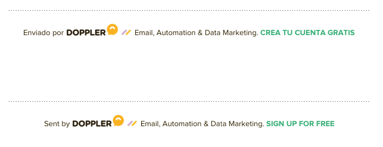

# Pie de pagina

<table align="center" cellpadding="0" cellspacing="0">
  <tr>
    <td align="center" valign="top" style="font-size:14px; padding: 30px 0;">
      <span style="font-family: Helvetica; color: #555845; font-size: 11px; line-height: 19px;">
        © 2019 <a href="https://www.fromdoppler.com" style="text-decoration: none; color: #33AD73; " target="_blank">Doppler</a> LLC. Todos los derechos reservados.<br>
        <br>
        Te informamos que los datos personales contenidos en esta comunicación han sido recogidos en nuestros Formularios de Suscripción al Newsletter, cuyo responsable es Doppler LLC, dado que has prestado tu consentimiento
        para recibirlo.
        <br><br>
        Al realizar una suscripción, aceptas y consientes que tus datos sean almacenados por nuestra plataforma, cuyos servidores están en Estados Unidos, para gestionar el envío de los boletines correspondientes.
        <br><br>
        Podrás ejercer tus derechos de acceso, rectificación, limitación y eliminación de los datos escribiendo a <a href="mailto:legal@fromdoppler.com" style="text-decoration: none; color: #33AD73; " target="_blank">legal@fromdoppler.com</a>,
        así como presentar una reclamación ante una autoridad de
        control.
        <br><br>
        Si no deseas seguir recibiendo este Newsletter, puedes darte de baja automáticamente haciendo clic en el enlace que se encuentra más arriba.
        <br><br>
        Puedes consultar información adicional y detallada sobre la protección de tus datos personales en nuestra <a href="https://www.fromdoppler.com/legal/privacidad" style="text-decoration: none; color: #33AD73; " target="_blank">Política
          de Privacidad</a>.
      </span>
    </td>
  </tr>
</table>

Este snippet va en el cuerpo del email:

```html
<tr>
  <td align="center" valign="top" style="font-size:14px; padding: 30px 0;">
    <span style="font-family: Helvetica; color: #555845; font-size: 11px; line-height: 19px;">
      © 2019 <a href="https://www.fromdoppler.com" style="text-decoration: none; color: #33AD73; " target="_blank">Doppler</a> LLC. Todos los derechos reservados.<br>
      <br>
      Te informamos que los datos personales contenidos en esta comunicación han sido recogidos en nuestros Formularios de Suscripción al Newsletter, cuyo responsable es Doppler LLC, dado que has prestado tu consentimiento
      para recibirlo.
      <br><br>
      Al realizar una suscripción, aceptas y consientes que tus datos sean almacenados por nuestra plataforma, cuyos servidores están en Estados Unidos, para gestionar el envío de los boletines correspondientes.
      <br><br>
      Podrás ejercer tus derechos de acceso, rectificación, limitación y eliminación de los datos escribiendo a <a href="mailto:legal@fromdoppler.com" style="text-decoration: none; color: #33AD73; " target="_blank">legal@fromdoppler.com</a>,
      así como presentar una reclamación ante una autoridad de
      control.
      <br><br>
      Si no deseas seguir recibiendo este Newsletter, puedes darte de baja automáticamente haciendo clic en el enlace que se encuentra más arriba.
      <br><br>
      Puedes consultar información adicional y detallada sobre la protección de tus datos personales en nuestra <a href="https://www.fromdoppler.com/legal/privacidad" style="text-decoration: none; color: #33AD73; " target="_blank">Política
        de Privacidad</a>.
    </span>
  </td>
</tr>
```


