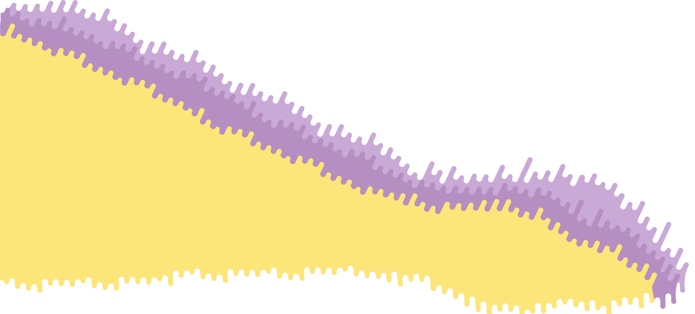

<!-- _coverpage.md -->

# Componentes para Emails <small>v0.0</small>

> Documentación de componentes para maquetar emails

- Simple y sencillo de utilizar
- Documentación de buenas practicas
- Componentes planos e interactivos

[GitHub](https://github.com/componentesparaemails/)
[Comenzar](/_foundation/_grid-system.md)

<!-- background image -->

